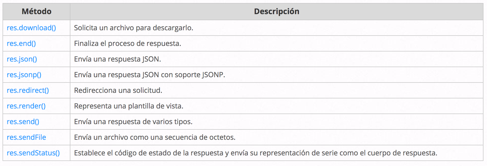

# **Direccionamiento**
Como ya se había dicho en el capítulo anterior, el direccionamiento hace referencia a la definición de puntos finales de aplicación (URI) y cómo responden a las solicitudes de cliente.

## Métodos de ruta
Un método de ruta se deriva de uno de los métodos HTTP y se adjunta a una instancia de la clase express.

Express da soporte a los siguientes métodos de direccionamiento que se corresponden con los métodos HTTP: get, post, put, head, delete, options, trace, copy, lock, mkcol, move, purge, propfind, proppatch, unlock, report, mkactivity, checkout, merge, m-search, notify,  subscribe, unsubscribe, patch, search y connect.

Hay un método de direccionamiento especial, app.all(), que no se deriva de ningún método HTTP. Este método se utiliza para cargar funciones de middleware en una vía de acceso para todos los métodos de solicitud.

Algunos ejemplos de estos métodos fueron mostrados en el primer capítulo de estos apuntes.

## Vías de acceso de ruta
Las vías de acceso de ruta, en combinación con un método de solicitud, definen los puntos finales en los que pueden realizarse las solicitudes. Dichas vías pueden ser series, patrones de serie o expresiones regulares.

## Manejadores de rutas
Puede proporcionar varias funciones de devolución de llamada que se comportan como middleware para manejar una solicitud. La única excepción es que estas devoluciones de llamada pueden invocar next('route') para omitir el resto de las devoluciones de llamada de ruta. Puede utilizar este mecanismo para imponer condiciones previas en una ruta y, a continuación, pasar el control a las rutas posteriores si no hay motivo para continuar con la ruta actual.

Los manejadores de rutas pueden tener la forma de una función, una matriz de funciones o combinaciones de ambas.

## Métodos de respuesta
Los métodos en el objeto de respuesta (res) de la tabla siguiente pueden enviar una respuesta al cliente y terminar el ciclo de solicitud/respuestas. Si ninguno de estos métodos se invoca desde un manejador de rutas, la solicitud de cliente se dejará colgada.

## app.route()
Puede crear manejadores de rutas encadenables para una vía de acceso de ruta utilizando app.route(). Como la vía de acceso se especifica en una única ubicación, la creación de rutas modulares es muy útil, al igual que la reducción de redundancia y errores tipográficos.

##express.Router
Utilice la clase express.Router para crear manejadores de rutas montables y modulares. Una instancia Router es un sistema de middleware y direccionamiento completo; por este motivo, a menudo se conoce como una “miniaplicación”.
